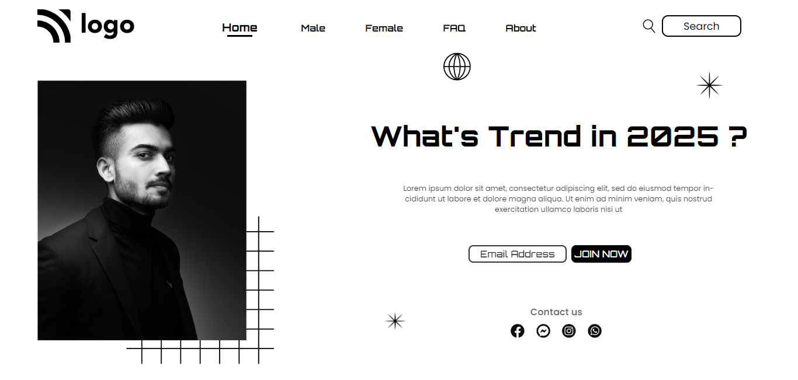

# PRANAV MATHUR

## Learnings from the project:

- Positioning elements
- Using pseudo elements and classes (nth-child, after etc)
- Attribute selectors

## Time taken:

    It took me a week just to understand positioning of elements and their implimentation to real life projects. I kept re-doing things and finally got it to look perfect by the end of the week.

## Screenshots:

## Live link:

[Go to site](https://street-style-landing-page-01.netlify.app/)
